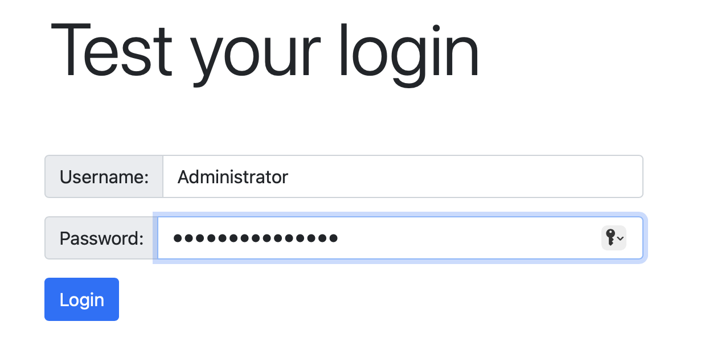

# Jetty LDAP Login

A simple tool to test LDAP Authorization using Jetty.

## Running the Application

Execute:

```bash
gradle run
```

This will start a Web Server on port 8080.  Test your credential using the input fields:



If the credentials have successfully been authorized against the LDAP Server, you'll see:

